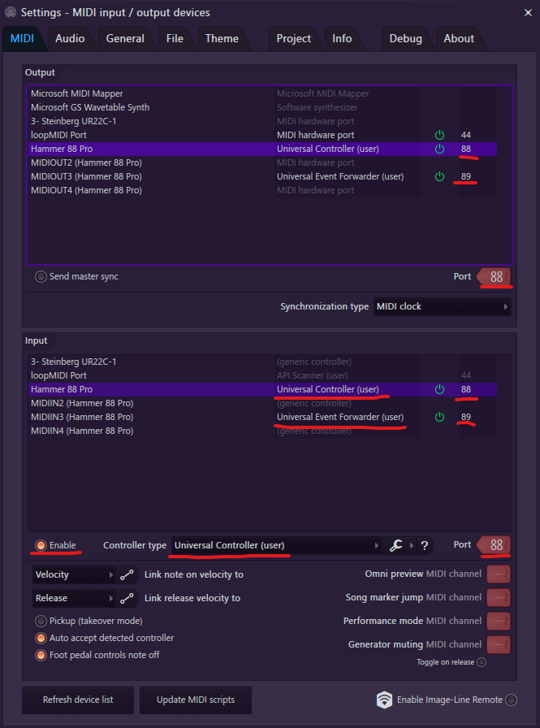

# M-Audio Hammer 88 Pro

## Setup

Continuing from the primary setup instructions. In order for the controller to
work correctly, DAW and Preset configurations need to be sent to the device.

1.  Download the preset files for the controller from
    [the script resources folder](../../../resources/device_configs/maudio/hammer88pro/)

2.  Open the Hammer 88 Pro Preset Editor Program (this can be installed with the
    included software bundle for your controller).

3.  Ensure that the Preset tab is selected.

4.  In the file menu, choose "Load Preset". Navigate to the script's folder, then
    choose the device's configuration from your downloads folder.

5.  In the file menu, choose "Send Preset", and send the preset to RAM.

6.  Use the "Send Preset" tool again to send it to a bank of your choosing.
    Note that if you don't choose Bank 1, this preset won't be loaded by default
    in by the keyboard, and you'll need to switch to it each time.

7.  Switch to the DAW tab in the preset editor, then choose "Load Preset" again,
    selecting the device's configuration again.

8.  Use the "Send Preset" tool again to send the configuration to the device.

9.  On the controller, press and hold the DAW button. When the menu appears on
    the display, use the jog wheel to select the DAW as "FL-Univ". Press the jog
    wheel to confirm the selection.

10. Open FL Studio's MIDI Settings, and set a port for the controller listed as
    `MIDIIN3 (Hammer 88 Pro)` in both the input and output sections. Assign this
    device to the controller type "Universal Event Forwarder (user)", so that
    events from this script can be forwarded to the main script to be processed.

### Example configuration

## Usage

#### Channel Selection
Note that channel 10 is used by the drum pads, and as such notes that use the
same event as the drum pads won't be detected correctly.

#### Bank Selection
Currently, the script doesn't support bank switching. Please keep your device on
bank 1. If this is an important feature to you, please feel free to contact me
on the Discord, and we can work to implement it.

#### Jog Wheel Usage
The controller can behave differently depending on the state of the jog wheel.
When it is used normally, it will change selections and scroll. If it is turned
while pressed, it will either move items, or scroll along a different axis.

## Who to contact
This device is maintained by Miguel Guthridge. Discord: ***HDSQ#2154***.
