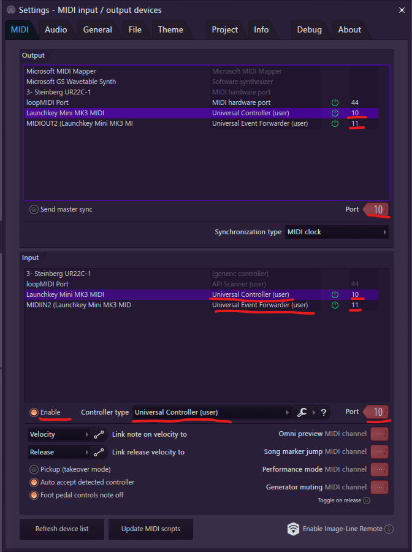

# Novation Launchkey Mk3 Mini

## Setup

Continuing from the primary setup instructions.

1. Assign the second MIDI port for your device to the Universal Event
   Forwarder.

### Example configuration

## Device Details

* The right-facing arrow button next to the drum pads is mapped to be a
  control switch button.

* The stop/solo/mute button can be used to open a menu that allows the drum
  pads to mute and solo tracks on the mixer, channel rack, and playlist.

* Holding the shift button enabled alternate controls:

  * Right-facing arrow and stop/solo/mute are up and down

  * Arp and fixed chord are left and right

  * Record is capture MIDI

* Double pressing the play button opens a menu that allows the drum pads to
  switch between recent activities.

## Who to contact

This device is maintained by Miguel Guthridge. [Email](mailto:hdsq@outlook.com),
Discord: ***HDSQ#2154***.
