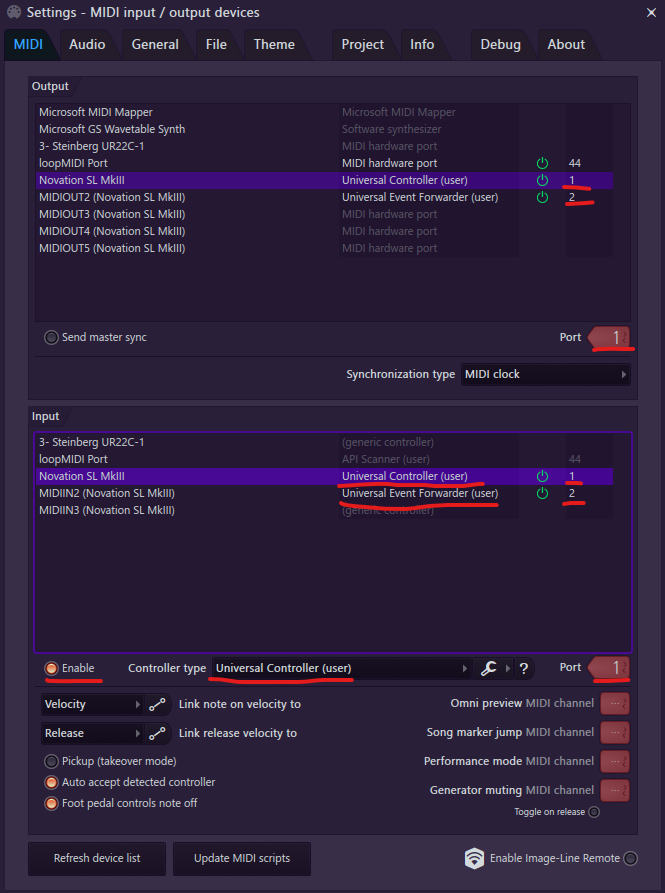

# Novation SL Mk3

## Setup

Continuing from the primary setup instructions.

1. Assign the second MIDI port for your device to the Universal Event
   Forwarder.

### Example configuration

## Device Details

* The buttons above the drum pads can be used to pick tools in the playlist
  and piano roll.

* The Options button can be used to toggle between different plugin
  interfaces (eg step sequencer and omni preview in the channel rack).

* The buttons above the faders can be used to mute/solo tracks/channels.

* The screens currently do not display any information, but I plan on
  expanding on this in the future.
