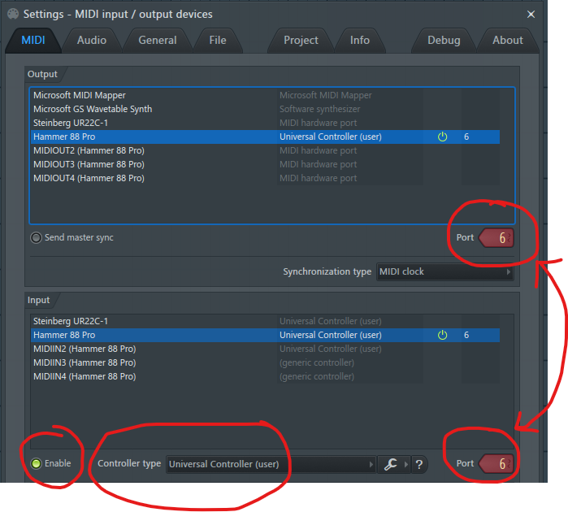

# Setup

To install the script, the following steps are recommended. Note that if you
intend to contribute code to the script, you should follow the
[contributor setup instructions](contributing/README.md) instead.

1.  Make sure you're in the [Discord server](https://discord.gg/6vpfJUF), so
    that you'll get notified when updates are released. You can also ask for
    tech support there.

2.  Go to the releases tab and download the latest `build.zip`.

3.  Open it in an archive manager of your choice.

4.  In a different window, navigate to
    `Documents/Image-Line/FL Studio/Settings/Hardware` in your file manager.

5.  Extract the zip folder to a new `UniversalController` folder located within
    the `Hardware` folder.

6.  Launch (or close and relaunch) FL Studio, and open the MIDI Settings
    window.

7.  Set your desired controller's ports to be the same (non-zero) value in both
    the input and output sections. Refer to the image for an example setup. For
    controllers with multiple MIDI devices, each should have a different
    assigned port number.

8.  Select the controller in the input section, and change the controller type
    to `Universal Controller (user)`. Make sure the controller is enabled.

9.  Navigate to the script output window (View > Script output), and select
    your device's tab.

10. Wait 3 seconds - if no errors appear, your device was detected
    successfully.

11. Familiarise yourself with your device's specific functionality in the
    [devices section](devices/README.md), making sure to complete any
    additional setup requirements. Enjoy using your device!

12. If you get an error, then your device couldn't be detected. Usually this
    means that your device doesn't have a definition (I'd love if you
    [contributed one](contributing/README.md)), but if you're sure your
    device does, it may just need some manual configuration. Refer to its
    manual page in the [devices section](devices/README.md).

Don't forget to read the basic [usage instructions](usage.md) for the script
so that you can take full advantage of the integration it provides!

Note that you'll need to download and extract the `build.zip` file for all new
updates. When Image-Line introduce their new distribution system, I will switch
to that, which will hopefully simplify things a bit.

## Images

